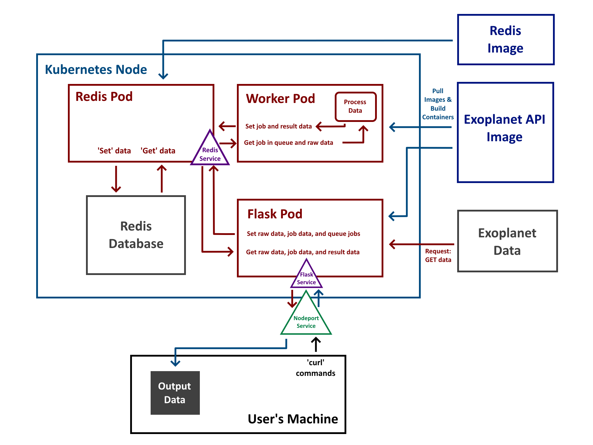

# NASA Exoplanet Archive Database Application

The Exoplanet Archive Database Application provides an app for retireving, parsing, and graphing data from the NASA Exoplanet Archive [1]. The primary script, flask_api.py, fetches the exoplanet data from the archive and adds it to a redis database, from which the entire dataset can be retrieved in json format or information regarding specific planets can be retrieved. Additionally, filters can be applied in order to produce a more narrow dataset and stars can be searched in order to find their respective exoplanetary satellites.

## Folder Contents

- **src** - source file folder
  - **flask_api.py**: Python3 app script for fetching exoplanet data and adding it to a redis database, as well as retrieving information.
  - **jobs.py**: Module containing several helper functions for creating, identifying, and updating jobs.
  - **worker.py**: Script that uses hotqueue to accept jobs and create graphs based on inputs.
- **test** - test file folder
  - **test_api.py**: Script for testing gene api scripts.
  - **test_jobs.py**: Scipt for testing the job functions (calls major functions that accesses the rest of the functions).
  - **test_worker.py**: Script for testing the worker functions.
- **Dockerfile**: Dockerfile for building the Docker image containing the app scripts and uses dependencies from requirements.txt.
- **requirements.txt**: contains code dependencies
- **docker-compose.yaml**: Composition file for creating the flask and redis server images.
- **data** - output log data folder
- **kubernetes** - kubernetes folder
   - **prod** - product folder containing the necessary files for deploying the app via kubernetes
      - app-prod-deployment-flask.yml
      - app-prod-deployment-redis.yml
      - app-prod-deployment-worker.yml
      - app-prod-ingress-flask.yml
      - app-prod-pvc-redis.yml
      - app-prod-service-flask.yml
      - app-prod-service-nodeport-flask-yml
      - app-prod-service-redis.yml
    - **test** - test folder for the creation of a test environment
      - app-test-deployment-flask.yml
      - app-test-deployment-redis.yml
      - app-test-deployment-worker.yml
      - app-test-ingress-flask.yml
      - app-test-pvc-redis.yml
      - app-test-service-flask.yml
      - app-test-service-nodeport-flask-yml
      - app-test-service-redis.yml

## The Data Used

The data used in the application can be obtained from the [Planetary Systems Spreadsheet in the NASA Exoplanet Science Institute](https://exoplanetarchive.ipac.caltech.edu/cgi-bin/TblView/nph-tblView?app=ExoTbls&config=PS). The data is downloaded in csv format.

## Deploying and Testing the Application Locally

This project contains a Dockerfile, a `requirements.txt` file, and a `docker-compose.yaml` file which will build images for the Flask application, worker script, and the Redis database, install the needed dependencies, and run both containers as well as the redis container to store the needed databases. Using the command:

`docker-compose up -d`

will build all needed images and run each container in the background of the terminal. The python scripts, test scripts, and the `requirements.txt` file will be located in a directory `/app` in the container, and the database the Redis client will use will volume mount the directory, `/data`, to store the database it creates.

The test scripts can be run with the command:

`docker exec <container-id> pytest`

using the ID of the flask container.

## Deploying and Testing using Kubernetes

This project also contains kubernetes files for deploying the app in either a production or test environment. Using the command:

`kubectl apply -f <fileName>`

for each file will allow the application to function. Ideally, apply the objects in this order:

1. Services - Allows the pods to communicate with each other and usage of `curl` commands

2. PVCs - Allows the pods to use a directory located in the project, `/data` in this case

3. Ingresses - Allows the usage of public endpoints

4. Deployments - Creates the pods to use, using images pulled from Dockerhub, the services, PVCs, and ingresses

Once all objects are running, public routes can be used with `curl` commands, and test scripts can be run with the command

`kubectl exec <flask-pod-name> pytest`

## Using the Application

The main method of interaction with the application is through `curl` commands. These commands will be in the format `curl -X [TYPE] '<URL>'`, where `[TYPE]` is the type of request and `<URL>` is the URL which varies depending if the application is run locally or through a public endpoint. The following paths and request types are available in the application:

- `/help`
    - `GET` - Returns a dictionary, listing all routes and example usages

- `/data`
    - `GET` - Get all raw data stored in the redis database
    - `POST` - Obtain data from the Exoplanet Archive Database and store it in the redis database
    - `DELETE` - Delete all raw data stored in the redis database

- `/planets`
    - `GET` - Get a list of all planets within the redis database

- `/planets/<planet_id>`
    - `GET` - Return the data associated with a given planet ID

- `/planets/filter?<key>=<value>`
    - `GET` - Return all planet data that has the value `<value>` in the key `<key>`

- `/planets/search?name=<planet_name>`
    - `GET` - Return data associated with a given planet name (case insensitive)

- `/planets/advanced-filter`
    - `POST` - Returns all planet data with key-value pairs that match the json packet provided
        - Example: `planets/advanced-filter' -d '{'filters': {'discoverymethod': 'Transit'}}' -H 'Content-Type: application/json'`

- `/stars`
    - `GET` - Get a list of all stars within the redis database

- `/stars/<star_id>`
    - `GET` - Return the data associated with a given star ID

- `/jobs`
    - `GET` - Return a list of all jobs created
    - `POST` - Create a job according to the json packet provided. `organize_by` is optional, available options are "Orbit_Period", "Mass", and "Radius"
        - Example: `/jobs' -d '{'start_date': 2000, 'end_date': 2009, 'organize_by': 'Orbit_Period'}' -H 'Content-Type: application/json'`

- `/jobs/<job_id>`
    - `GET` - Return the json dictionary associated with a given job ID

- `/results/<job_id>`
    - `GET` - Return the image created from a given job ID once completed
        - Example: `/results/54321 -o output.png`

### Using the Application Locally

Routes can be used with the command:

`curl -X [TYPE] http://localhost:5000/<path>`

where `[TYPE]` is the type of request, and `<path>` is an available route in the API.

The application can be stopped by running the command:

`docker-compose down`

### Using the Application with Public Endpoints

Routes can be used with the command:

`curl -X [TYPE] 'http://exoplanets.coe332.tacc.cloud/<path>`

where `[TYPE]` is the type of request, and `<path>` is an available route in the API.

To stop the application the command:

`kubectl delete <object> <object_name>`

must be done for all deployments, services, ingresses, and pvcs.

### Software Diagram

This software diagram displays each component of the API as deployed through Kubernetes, including each container and service that runs in the api and the databases used. Arrows indicate a command used by the user, scripts, or kubernetes that get the docker images, transfer data to and from the redis databases, process that data, and display them in the user's terminal window.

